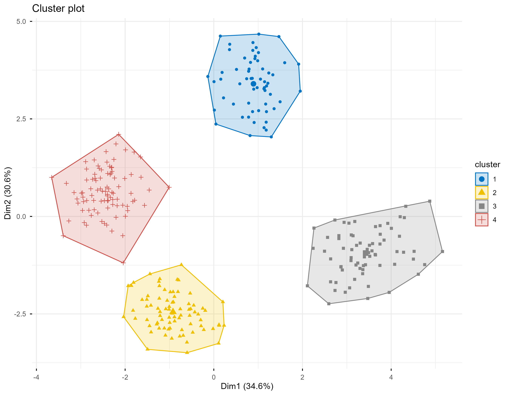
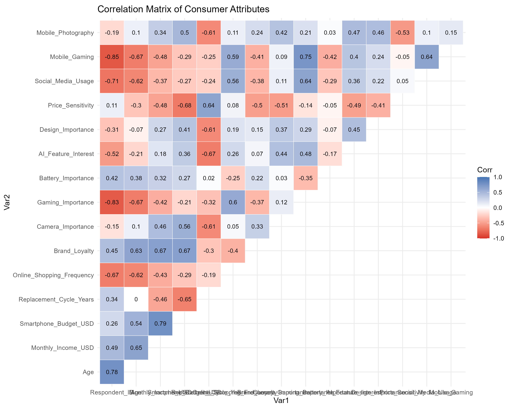
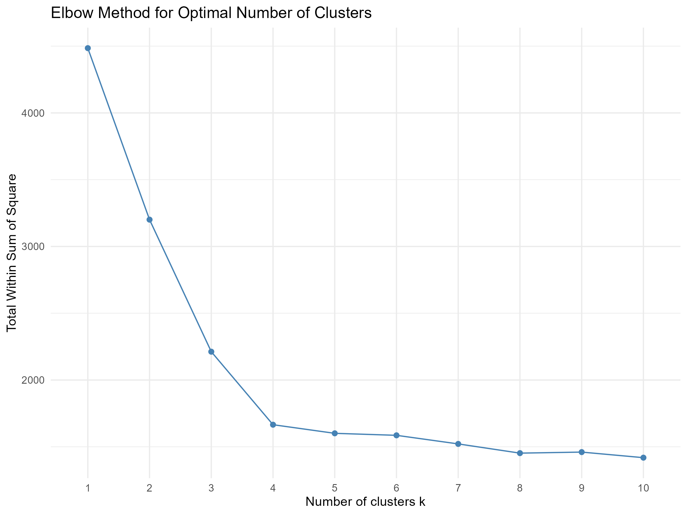

# Consumer Segmentation using K-Means Clustering in R

<p align="center">

</p>

<p align="center">
<b>Figure 1.</b> Customer Segmentation Visualized using Principal Component Analysis (PCA)
</p>

---

## Project Summary

Customer segmentation is one of the most widely used applications of machine learning in marketing and consumer analytics.

This project applies **K-Means Clustering** to identify distinct smartphone consumer segments based on demographic characteristics, purchasing behavior, and product preferences.

The analysis demonstrates how machine learning can support customer targeting, product positioning, and marketing strategy through data-driven segmentation.

---

# Business Problem

Many companies still design products and marketing campaigns under the assumption that all customers behave similarly.

This project aims to answer:

- How many meaningful customer segments exist?
- What differentiates each segment?
- Which customer groups should receive different marketing strategies?
- How can segmentation improve business decision-making?

---

# Dataset

The project uses a simulated dataset containing **300 smartphone consumers**.

Variables include:

| Category | Variables |
|-----------|-----------|
| Demographics | Age, Gender, Occupation |
| Financial | Monthly Income, Smartphone Budget |
| Purchase Behavior | Replacement Cycle, Online Shopping Frequency |
| Brand Preference | Brand Loyalty |
| Product Preference | Camera, Gaming, Battery, AI Feature, Design |
| Consumer Behavior | Price Sensitivity, Social Media Usage, Mobile Gaming, Mobile Photography |

The dataset was created specifically for portfolio purposes.

---

# Analytical Workflow

```text
Data Collection
      │
      ▼
Data Cleaning
      │
      ▼
Exploratory Data Analysis
      │
      ▼
Correlation Analysis
      │
      ▼
Feature Selection
      │
      ▼
Feature Scaling
      │
      ▼
Elbow Method
      │
      ▼
K-Means Clustering
      │
      ▼
Cluster Profiling
      │
      ▼
Business Recommendation
```

---

# 🔍 Exploratory Data Analysis

Before clustering, exploratory analysis was conducted to understand variable distributions and relationships.

### Correlation Heatmap

<p align="center">

</p>

The analysis indicates moderate positive relationships among several purchasing-related variables, including monthly income, smartphone budget, and brand loyalty.

---

# Determining the Optimal Number of Clusters

The Elbow Method was used to determine the optimal number of clusters.

<p align="center">

</p>

The elbow occurs at **k = 4**, indicating that four customer segments provide the optimal trade-off between model simplicity and within-cluster variance.

---

# K-Means Clustering Result

The final K-Means model identified **four distinct customer segments**.

Principal Component Analysis (PCA) was used to project the multidimensional data into two dimensions for visualization.

<p align="center">

</p>

The visualization shows clear separation among customer groups, indicating that the clustering model successfully captures meaningful differences in consumer behavior.

---

# Customer Personas

| Persona | Characteristics | Business Opportunity |
|----------|----------------|----------------------|
| 🟦 Mature Practical Users | Older consumers with moderate income who prioritize reliability and battery life | Promote durability, long battery performance, and dependable after-sales service |
| 🟨 Young Digital Enthusiasts | Younger consumers interested in gaming, technology, and online shopping | Focus on gaming performance, influencer marketing, and digital campaigns |
| ⬛ Premium Professionals | High-income consumers with strong brand loyalty and premium preferences | Position flagship products with AI features and premium camera capabilities |
| 🟥 Budget-Conscious Students | Young consumers with limited purchasing power and high price sensitivity | Offer affordable models, cashback, installment plans, and student promotions |

---

# Business Recommendations

| Customer Segment | Recommended Marketing Strategy |
|------------------|--------------------------------|
| Mature Practical Users | Reliability, battery performance, and customer support |
| Young Digital Enthusiasts | Gaming campaigns, TikTok, YouTube creators, online-exclusive promotions |
| Premium Professionals | Premium branding, AI innovation, flagship launches |
| Budget-Conscious Students | Entry-level models, discounts, student pricing, financing options |

---

# Technologies Used

- R
- tidyverse
- ggplot2
- ggcorrplot
- factoextra
- K-Means Clustering
- Principal Component Analysis (PCA)

---

# Key Findings

- Four distinct consumer segments were identified.
- Income and smartphone budget showed meaningful relationships with purchasing behavior.
- Different customer groups exhibit different product priorities, including gaming, battery, camera quality, and AI features.
- The segmentation results provide actionable insights for marketing strategy and product positioning.

---

# Future Improvements

Potential extensions of this project include:

- Hierarchical Clustering
- DBSCAN Clustering
- Silhouette Score Evaluation
- Interactive Dashboard using Shiny
- Predictive Customer Lifetime Value (CLV)

---

# Author

**Umiwithdata*

Market Research | Consumer Insight | Data Analytics

**GitHub:** https://github.com/umiwithdata
